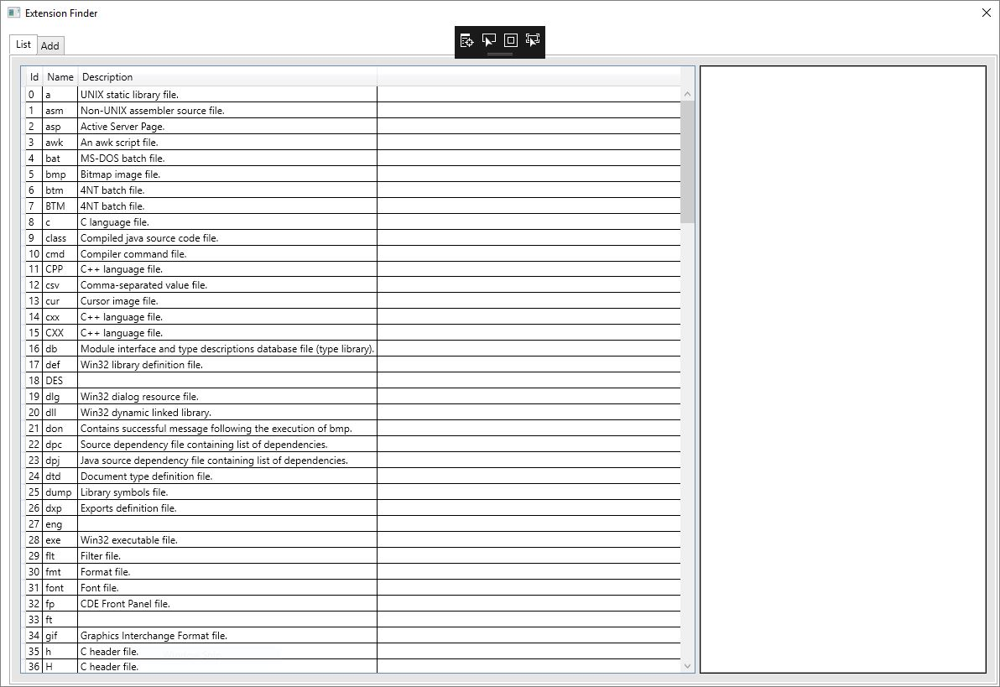
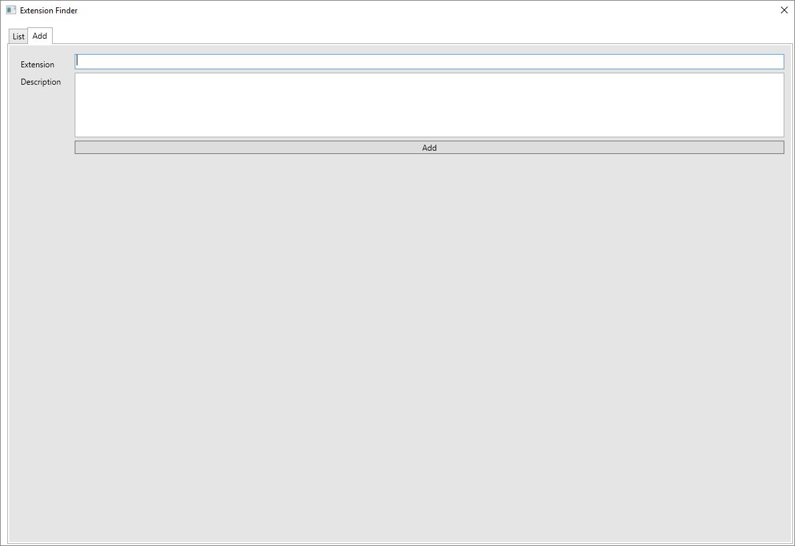

# Extention Finder as WPF App

Application allows browsing, filtering and creating file extension.

## Screenshots

## Solution structure

 - ExtensionFinder - WPF App
 - ExtensionFinder.Db - Class Library being a data source
 - ExtensionFinder.Models - Class Library containing data models

